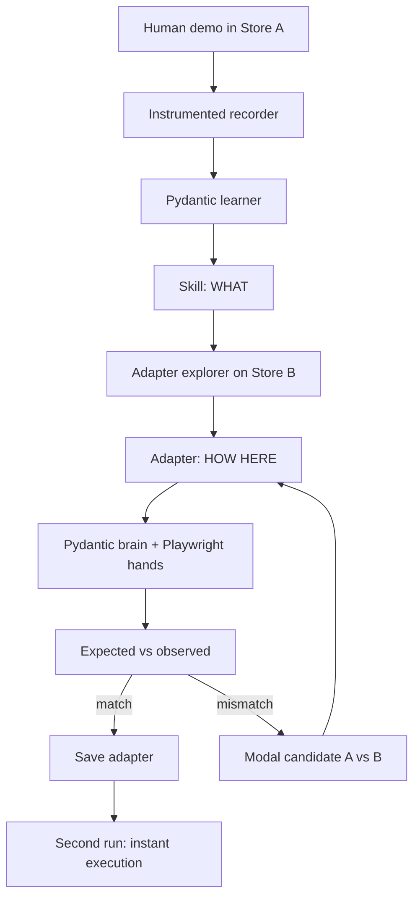
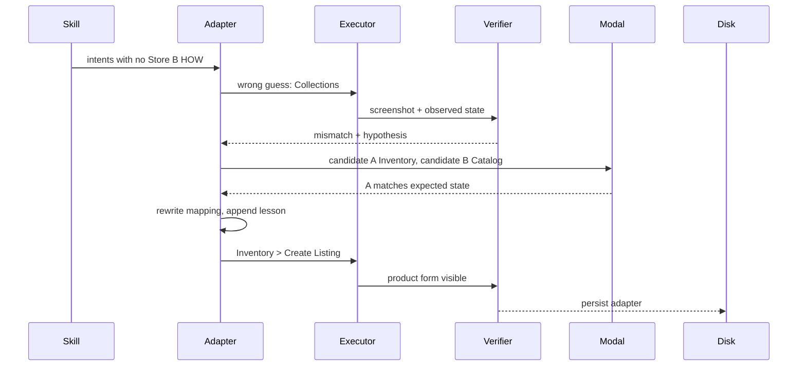

# SkillShift — Architecture

A research prototype, not a SaaS. Two Next.js fake stores, a Python agent (Pydantic AI + Playwright), and Modal sandboxes for recovery.

```text
Skill   = WHAT          (app-agnostic, frozen after learning)
Adapter = HOW HERE      (app-specific, mutable)
```

See [PLAN.md](PLAN.md) for build order, timeline, and cut-line. This file is the structural source of truth.

---

## System



Store A is the teaching environment. Store B is the unseen environment. The first Store B run is designed to pick the wrong nav item (`Collections` instead of `Inventory`), so the verifier, recovery loop, and adapter mutation are visible.

---

## Typed models

Pydantic schemas are the source of truth. The agent must emit these objects, not free-form prose.

### Skill — what the task is

App-agnostic. No `click Products`, no `click Publish`.

```python
class SkillStep(BaseModel):
    intent: str
    required_inputs: list[str]
    expected_state: str
    success_condition: str

class Skill(BaseModel):
    name: str
    goal: str
    inputs: list[str]
    steps: list[SkillStep]
    final_success_condition: str
```

Learned example:

```json
{
  "name": "publish_product",
  "goal": "Create and publish a sellable product listing",
  "inputs": ["name", "price", "image"],
  "steps": [
    {
      "intent": "start creating a new sellable item",
      "required_inputs": [],
      "expected_state": "a product creation form is visible",
      "success_condition": "a form with name, price, and image fields is on screen"
    },
    {
      "intent": "provide basic product information",
      "required_inputs": ["name", "price"],
      "expected_state": "name and price are populated",
      "success_condition": "the form shows the provided name and price"
    },
    {
      "intent": "attach the product image",
      "required_inputs": ["image"],
      "expected_state": "product image preview is visible",
      "success_condition": "an image preview appears on the listing"
    },
    {
      "intent": "make the product publicly available",
      "required_inputs": [],
      "expected_state": "product is published",
      "success_condition": "a public product card is visible"
    }
  ],
  "final_success_condition": "a sellable product card exists with the given name, price, and image"
}
```

The Skill is frozen after the learner writes it. Recovery never rewrites intents.

### Adapter — how this app implements it

```python
from typing import Literal

class StepMapping(BaseModel):
    semantic_intent: str
    app_action: str
    confidence: float
    learned_from: Literal["exploration", "recovery", "cached"]

class EnvironmentAdapter(BaseModel):
    app_id: str
    skill_name: str
    mappings: list[StepMapping]
    failure_lessons: list[str] = []
```

After a successful Store B recovery:

```json
{
  "app_id": "store-b",
  "skill_name": "publish_product",
  "mappings": [
    {
      "semantic_intent": "start creating a new sellable item",
      "app_action": "Inventory > Create Listing",
      "confidence": 0.9,
      "learned_from": "recovery"
    },
    {
      "semantic_intent": "make the product publicly available",
      "app_action": "Go Live",
      "confidence": 0.85,
      "learned_from": "exploration"
    }
  ],
  "failure_lessons": [
    "Collections is collection management, not product creation"
  ]
}
```

`learned_from` is part of the demo story:

| Value | Meaning |
| --- | --- |
| `exploration` | First guess against an unseen UI |
| `recovery` | Written after a verifier mismatch |
| `cached` | Loaded from disk on a later run |

### Verification — expected vs observed

```python
class Verification(BaseModel):
    step_intent: str
    expected_state: str
    observed_state: str
    matched: bool
    hypothesis: str | None = None
    alternative: str | None = None
```

Mismatch example:

```text
Expected:  product creation form containing image, title and price inputs
Observed:  collection management interface
Hypothesis: "Collections" was incorrectly mapped to product creation
Alternative: Inventory
```

On mismatch, mutate **only** the matching `StepMapping` and append a `failure_lesson`. Do not edit the Skill.

### Demonstration trace

Recorder output, not a Skill. The learner consumes this.

```python
class TraceEvent(BaseModel):
    before: str          # screenshot path
    action: Literal["click", "fill", "upload"]
    target: str
    value: str | None = None
    after: str           # screenshot path
```

---

## Repo layout

```text
skillshift/
├── PLAN.md
├── ARCHITECTURE.md
├── web/                      # Next.js
│   ├── store-a/              # Products → Add Product → Media → Publish
│   ├── store-b/              # Inventory → Create Listing, Go Live, misleading Collections
│   └── dashboard/            # four cards: Skill / App / Adapter / Status
├── agent/
│   ├── models.py             # Skill, Adapter, Verification, TraceEvent
│   ├── learner.py            # demonstration → Skill
│   ├── adapter.py            # Skill + new UI → adapter
│   ├── executor.py           # Playwright hands
│   ├── verifier.py           # expected vs observed
│   └── recovery.py           # revise adapter; call Modal
├── adapters/
│   └── store_b__publish_product.json
└── modal/
    └── recovery_runner.py    # isolated candidate A vs B
```

Keep the codebase tiny. Every file exists to support the Skill / Adapter split or to make that split visible.

---

## Runtime loop

### Brain and hands

```text
Pydantic Agent                 Playwright
      │
      ├── screenshot()     →   capture viewport
      ├── visible_elements() → accessibility / DOM summary
      ├── click(element)   →   locator click
      ├── type(element, text)
      └── upload(element, image)
```

Pydantic AI owns planning, mapping, verification, and recovery. Playwright only executes primitive actions. Browser Use and Stagehand are reference points for those primitives, not a second brain.

### First run on Store B



### Adapter-only mutation

| Object | First run | On mismatch | Second run |
| --- | --- | --- | --- |
| Skill | Loaded, frozen | Unchanged | Reused as-is |
| Adapter | Explored, likely wrong | Mapping rewritten, lesson stored | Loaded from disk, `learned_from: cached` |
| Store UI | Unseen | Same app, same pages | Same app, new product inputs |

### Persistence

No database. One file per app + skill:

```text
adapters/store_b__publish_product.json
```

Run 2 looks up `app_id` + `skill_name`, skips exploration, and executes the cached mappings with new inputs (for example: blue sneaker, £120).

---

## Modal recovery

Modal is not “the host.” It is isolated scratch environments for competing interpretations.

```text
FAILURE
   ↓
Candidate A: Inventory → Create Listing
Candidate B: Catalog → New Item
   ↓
Modal sandbox A          Modal sandbox B
try mapping A            try mapping B
screenshot               screenshot
expected state?          expected state?
   ↓
keep the match, discard the rest
   ↓
write StepMapping.learned_from = "recovery"
```

Two candidates are enough. Each sandbox gets a clean Store B, applies one mapping, screenshots, and returns a `Verification`. The parent process keeps the match.

Sponsor line:

> Modal gives the agent parallel scratch environments in which it can safely test competing interpretations of unfamiliar software before updating its learned adapter.

If Modal slips off the timeline, run the same two candidates sequentially on the local executor and keep the dashboard story identical.

---

## Dashboard contract

One screen. Four cards side by side. This is the only UI that needs polish.

```text
┌────────────────────┐  ┌────────────────────┐  ┌────────────────────┐  ┌────────────────────┐
│ LEARNED SKILL      │  │ CURRENT APP        │  │ ADAPTER            │  │ STATUS             │
│                    │  │                    │  │                    │  │                    │
│ Publish Product    │  │ Store B            │  │ Create item        │  │ Skill loaded       │
│                    │  │                    │  │ → Inventory        │  │ Adapter learned    │
│ 1 Create item      │  │ Unseen environment │  │                    │  │ Product live       │
│ 2 Add details      │  │                    │  │ Publish            │  │                    │
│ 3 Add image        │  │                    │  │ → Go Live          │  │                    │
│ 4 Publish          │  │                    │  │                    │  │                    │
└────────────────────┘  └────────────────────┘  └────────────────────┘  └────────────────────┘
```

During recovery:

1. The wrong mapping turns red (`Create item → Collections`).
2. Status shows mismatch + hypothesis.
3. The mapping rewrites in place (`→ Inventory`).
4. Status flips to adapter learned / product live.

The Skill card never changes. That visual contrast *is* the architecture.

---

## Fake stores

Both live in the same Next.js app. Enough UI to create a product and show a card. Nothing else.

| | Store A `/store-a` | Store B `/store-b` |
| --- | --- | --- |
| Mental model | Multi-step seller wizard | Single-page listing form |
| Nav | Products | Inventory, Orders, **Collections** (decoy) |
| Create | Add Product | Create Listing |
| Media | Separate Media step | Image field on the same form |
| Finish | Publish | Go Live |
| Success | Product card | Product card |

Store B’s `Collections` section must look plausible enough that an explorer can pick it first. That decoy is load-bearing.

---

## Out of scope for MVP

- Full computer-use / desktop GUI stack
- Real video → key-frame extraction (stretch only)
- OmniParser or any extra vision parser
- Running UI-Mate or EvoSkill checkpoints
- Dual executors (Browser Use **and** Stagehand)
- Production auth, database, multi-tenant anything
- Using Pydantic only as a validator — it must own Skill / Adapter / Verification
- Using Modal only as a host — if Modal is in, it runs candidate recovery

Stretch, only after the loop works: video keyframes, Pydantic `TrajectoryJudge` for live steering, OmniParser as future grounding.
