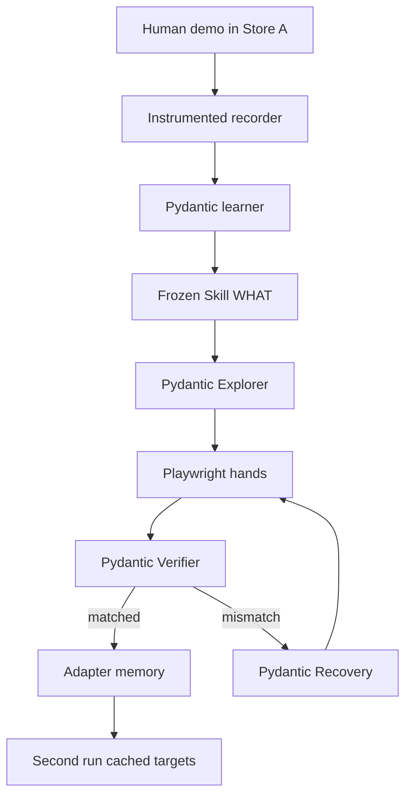

# SkillShift — Architecture

A research prototype, not a SaaS. Two Next.js fake stores, a Python agent (Pydantic AI + Playwright), and optional Modal sandboxes (R2).

```text
Skill   = WHAT          (app-agnostic, frozen after learning)
Adapter = HOW HERE      (app-specific, discovered and mutable)
```

Build history (not for judges): [docs/build/PLAN.md](docs/build/PLAN.md). This file is the structural source of truth.

---

## System



Store A is the teaching environment. Store B starts with an **empty** adapter. The agent grounds each Skill step from the current screenshot + `visible_elements()`, verifies expected state, recovers on mismatch (including real prerequisites like shipping), and persists `resolved_targets` for the second run.

Decoy UI (e.g. Collections) may be tried; that is not scripted. Wrong paths fail verification and trigger recovery.

---

## Typed models

Pydantic schemas are the source of truth. The agent must emit these objects, not free-form prose.

### Skill — what the task is

App-agnostic. No `click Products`, no `click Publish`.

```python
class SkillStep(BaseModel):
    intent: str
    required_inputs: list[str]
    expected_state: str
    success_condition: str

class Skill(BaseModel):
    name: str
    goal: str
    inputs: list[str]
    steps: list[SkillStep]
    final_success_condition: str
```

### Grounding — constrained actions

```python
class CandidateAction(BaseModel):
    target_testid: str   # must appear in visible_elements
    action: Literal["click", "fill", "upload", "select"]
    value: str | None = None
    rationale: str
    confidence: float

class ExploreResult(BaseModel):
    candidates: list[CandidateAction]
    chosen: CandidateAction
```

### Adapter — discovered HOW HERE

```python
class StepMapping(BaseModel):
    semantic_intent: str
    app_action: str                 # human-readable memory string
    confidence: float
    learned_from: Literal["exploration", "recovery", "cached"]
    resolved_targets: list[str] = []  # replay trail for run 2
```

### Verification

```python
class Verification(BaseModel):
    step_intent: str
    expected_state: str
    observed_state: str
    matched: bool
    confidence: float = 1.0
    mismatch_type: Literal[
        "wrong_navigation",
        "missing_prerequisite",
        "wrong_input",
        "transient_failure",
        "unknown",
        "none",
    ] = "none"
    hypothesis: str | None = None
    alternative: str | None = None
```

---

## Runtime loop (Store B)

1. Load frozen Skill; load adapter or start with `mappings: []`.
2. For each Skill step: if `resolved_targets` cached → execute; else Explorer → act → Verifier.
3. On `missing_prerequisite` (e.g. shipping blocker): Recovery picks a visible control, persists a prerequisite mapping, retries the step.
4. On `wrong_navigation`: exclude failed testid, Recovery proposes another visible target.
5. Persist adapter; second product reuses cached targets.

Live transfer requires `GEMINI_API_KEY` (or another configured key) **or** `SKILLSHIFT_MOCK_LLM=1` for offline CI. There is no silent hardcoded Store B decision table on the live path.

Playwright primitives (`click` / `type` / `upload` / `screenshot` / `visible_elements`) are hands only. `data-testid`s anchor the DOM; the model chooses among **visible** testids.

Campaign promo + Modal hypothesis scoring are **R2** ([docs/build/WAVE6.md](docs/build/WAVE6.md)) and must not drive R1 decisions.

---

## Dashboard

Four cards: Learned Skill · Current App · Adapter · Status. Live payload: `fixtures/live/dashboard-state.json`. Adapter mappings should reflect what the run discovered, including shipping lessons from verifier hypotheses.

---

## Hard rules

- Skill never mutates after learn.
- Adapter is memory of discovery, not a pre-authored Store B script.
- Explorer / Recovery must not invent testids outside `visible_elements()`.
- Store A / Store B UIs are authored environments; grounding is not.
