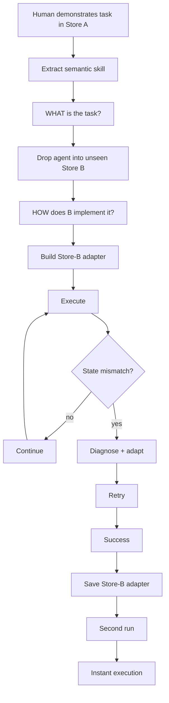

# SkillShift — Plan

Build a **minimal research demo**, not production software. Everything exists to prove one claim:

> A semantic skill learned in one application can acquire, repair, and persist an adapter for an unfamiliar application.

This is a hackathon prototype. Two fake seller portals, one recorded demonstration, one semantic skill, one environment adapter, one visible failure, one recovery, one second run that is instant because the adapter was saved.

## North star

```text
Skill   = WHAT          (app-agnostic)
Adapter = HOW HERE      (app-specific)
```

The sequence that must never be dropped:

```text
failure → diagnose → adapt → retry → persist adapter → second run is instant
```

If anything slips, drop real video understanding first, then parallel Modal branching. Never drop that sequence. That sequence *is* the project.

### Stack

| Layer | Choice | Role |
| --- | --- | --- |
| Fake stores + dashboard | Next.js | Deterministic UI the agent can learn from and transfer into |
| Agent brain | Python + Pydantic AI | Typed Skill / Adapter / Verification objects |
| Agent hands | Playwright | Screenshots, clicks, typing, uploads |
| Recovery | Modal sandboxes | Parallel candidate interpretations after a mismatch |
| Persistence | JSON files | No real database |

Do **not** build a full computer-use stack. Borrow recorder/skill ideas from Aloha / UI-Mate / EvoSkill. Use a much lighter browser executor.

---

## Demo flow



The first Store B run is **supposed to fail**. The agent initially maps “start creating a new sellable item” to the misleading `Collections` section. The verifier sees a collection-management screen instead of a product form, revises only the adapter, retries via `Inventory → Create Listing`, then persists the mapping. Run 2 skips exploration.

That failure-then-learning beat is the demo.

---

## Build in this order

Eight steps. Each has a goal, a done-when, and an explicit skip.

### 1. Two tiny fake seller portals

**Goal.** Give the agent a completely deterministic environment so transfer is visually undeniable.

Put both stores in the same Next.js app:

| Route | Structure | Finish action |
| --- | --- | --- |
| `/store-a` | `Products → Add Product → Media → Publish` | Publish |
| `/store-b` | `Inventory → Create Listing` (single-page form) plus a misleading `Collections` section | Go Live |

Both only need enough functionality to create a product and show a final product card.

**Done when.** A human can manually publish a product in Store A and Store B, and each store shows a product card afterwards.

**Skip.** Real commerce, auth, persistence beyond in-memory / local state, extra seller features.

### 2. Record a human demonstration in Store A

**Goal.** Capture a demonstration as a semantic trace, not as a replay script.

For the MVP, do **not** process arbitrary video. Record the screen for the visual demo **and simultaneously capture meaningful browser events**:

```text
screenshot before action → click/type event → screenshot after action
```

Inspiration: [ShowUI-Aloha](https://github.com/showlab/ShowUI-Aloha) (`Recorder → Learner → Planner → Actor → Executor`). Steal the recorder → semantic-trace idea, not their OS-level actor.

Captured demonstration, internally:

```json
[
  {
    "before": "frame_01.png",
    "action": "click",
    "target": "Add Product",
    "after": "frame_02.png"
  },
  {
    "before": "frame_02.png",
    "action": "fill",
    "target": "Product name",
    "value": "Leather Bag",
    "after": "frame_03.png"
  }
]
```

**Done when.** A Store A walkthrough produces a JSON trace of before/action/after events plus screenshots.

**Skip.** Video → key-frame extraction. If we finish early, replace the instrumented recorder. Judges only care that the concept works. Do not start there.

### 3. Demonstration → semantic Skill

**Goal.** Infer *what was being accomplished* and throw away app-specific wording. This is where the project diverges from replay automation.

Give a multimodal Pydantic agent the screenshots + actions. Inspiration: [UI-Mate](https://github.com/Tencent/UI-Mate) — a demonstration is **advice, not a script**, and the agent replans against the live environment when layout or state changes.

Schemas live in `ARCHITECTURE.md`. The learned object should look like:

```json
{
  "name": "publish_product",
  "goal": "Create and publish a sellable product listing",
  "inputs": ["name", "price", "image"],
  "steps": [
    {
      "intent": "start creating a new sellable item",
      "expected_state": "a product creation form is visible"
    },
    {
      "intent": "provide basic product information",
      "expected_state": "name and price are populated"
    },
    {
      "intent": "attach the product image",
      "expected_state": "product image preview is visible"
    },
    {
      "intent": "make the product publicly available",
      "expected_state": "product is published"
    }
  ]
}
```

There is **no** `click Products`, `click Add Product`, `click Publish` in that representation. That is the semantic layer.

**Done when.** A recorded Store A demo produces a `Skill` with app-agnostic intents and expected states.

**Skip.** Running UI-Mate’s checkpoint. We want the idea, not the 27B model.

### 4. Environment adapter, separately

**Goal.** Make `Skill = WHAT` / `Adapter = HOW HERE` extremely visible.

Inspiration: [EvoSkill-GUI](https://github.com/ZJU-REAL/EvoSkill-GUI) treats skills as editable packages (plan, fallback localisation, recovery rules, metadata, failure cases) and updates the relevant piece when execution fails. Steal the *structure*, not the research framework.

After learning Store B:

```json
{
  "app_id": "store-b",
  "skill_name": "publish_product",
  "mappings": [
    {
      "semantic_intent": "start creating a new sellable item",
      "app_action": "Inventory > Create Listing"
    },
    {
      "semantic_intent": "make the product publicly available",
      "app_action": "Go Live"
    }
  ]
}
```

This separation is the piece we polish in the presentation.

**Done when.** Skill and adapter are separate typed objects; Store B mappings can be created, mutated, and displayed without changing the Skill.

**Skip.** Reproducing EvoSkill’s complete training-free evolution stack.

### 5. Lightweight browser executor

**Goal.** Pydantic AI is the **brain**. Playwright is the **hands**.

```text
Pydantic Agent
      │
      ├── screenshot()
      ├── visible_elements()
      ├── click(element)
      ├── type(element, text)
      └── upload(element, image)
             ↓
        Browser / Playwright
```

[Browser Use](https://github.com/browser-use/browser-use) and [Stagehand](https://github.com/browserbase/stagehand) are inspiration for primitives. Do **not** let either own reasoning. Do **not** use both. Stay Python for the agent backend because Pydantic + Modal are Python-native.

**Done when.** The agent can walk Store B using a Skill + adapter: open the form, fill name/price, upload an image, hit Go Live, see a product card.

**Skip.** Desktop GUI models. OmniParser. Installing a second executor.

### 6. Make adaptation visible by causing a failure

**Goal.** Do not let Store B work perfectly immediately. This is the most important part of the demo.

Semantic intent:

```text
"start creating a new sellable item"
```

Store B nav:

```text
Collections
Inventory
Orders
```

Initial (wrong) adapter:

```text
Collections → Create
```

Next screenshot is wrong. Verifier compares:

```text
Expected:
"product creation form containing image, title and price inputs"

Observed:
"collection management interface"
```

Then, on the dashboard:

```text
ADAPTER MISMATCH DETECTED

Hypothesis:
"Collections" was incorrectly mapped to product creation.

Alternative:
"Inventory"
```

Retry. Success. Mutate **only** the adapter:

```diff
- new_sellable_item → Collections > Create
+ new_sellable_item → Inventory > Create Listing
```

This is a lightweight version of EvoSkill’s **reflect → revise → reuse** loop. GUI skills should not stay static when the environment contradicts their plan.

**Done when.** First Store B attempt fails on Collections, the verifier names the mismatch, the adapter updates in place, and retry succeeds via Inventory.

**Skip.** Fancy recovery UI beyond the four-card dashboard turning a mapping red, then rewriting it.

### 7. Modal for recovery experiments, not just hosting

**Goal.** After a mismatch, test competing interpretations in isolated scratch environments.

```text
              FAILURE
                 ↓
       ┌─────────┴─────────┐
     Modal A             Modal B
      try A               try B
        ↓                   ↓
 screenshot             screenshot
   expected state         wrong state
          ↓
      SAVE A
```

Two parallel candidates is enough. We do not need 50.

Sponsor line:

> Modal gives the agent parallel scratch environments in which it can safely test competing interpretations of unfamiliar software before updating its learned adapter.

That is much stronger than “our backend happens to run on Modal.”

**Done when.** A mismatch can spawn two Modal candidates; the one whose screenshot matches expected state is kept and written into the adapter.

**Skip.** Using Modal merely as an API host. If time slips, fall back to sequential local candidates and keep the same story on the dashboard.

### 8. Persist the adapter and prove learning with a second run

**Goal.** Show the system accumulated procedural knowledge, rather than asking a VLM to solve the website from scratch again.

No real database. Save:

```text
adapters/store_b__publish_product.json
```

Then give the agent another product:

> blue sneaker, £120

On run 2:

```text
Skill found:          publish_product
Environment recognised: Store B
Adapter found ✓
Exploration skipped

Inventory → Create Listing → Upload image → £120 → Go Live
SUCCESS
```

Study [Understudy](https://github.com/understudy-ai/understudy) for teach/replay UX. Our demo should put more emphasis on the explicit environment adapter and adaptation history.

**Done when.** Run 2 loads the saved adapter, skips exploration, and publishes a different product immediately.

**Skip.** Recreating Understudy’s whole desktop agent.

---

## Timeline

Given a 19:00 deadline:

| By roughly | Goal |
| --- | --- |
| **13:00** | Store A + Store B work manually |
| **14:00** | Demo trace → Pydantic `Skill` works |
| **15:15** | Agent can execute semantic skill in Store B |
| **16:00** | Mismatch → recovery → adapter update |
| **16:30** | Adapter persistence + second-run demo |
| **17:15** | Modal parallel recovery integrated |
| **18:00** | Dashboard + README + architecture graphic |
| **18:30** | Record the 2-minute demo |
| **19:00** | Submission |

### Cut-line

If anything slips, drop in this order:

1. Real video understanding
2. Parallel Modal branching complexity

**Never drop:** `failure → adaptation → second run is learned`

---

## Wave 7 — remaining agent pipeline

R1 already grounded Store B with Explorer / Verifier / Recovery. Further technical work is sequenced in [WAVE7.md](WAVE7.md) (from [prompts/skillshift_build_brief.md](../../prompts/skillshift_build_brief.md)):

1. Compact `observe_app` + test-only state API  
2. Independent verifier + failure taxonomy  
3. `AdapterPatch` applied only after verify  
4. Metrics / reuse_gain + naive replay baseline  
5. Modal scores real hypotheses  
6. Dashboard trace of that loop  

Agent prompts: [prompts/README.md](../../prompts/README.md) Wave 7. Do not restore hardcoded Store B HOW HERE.

---

## Wave 8 — wow factor: live perturbation + more environments

Wave 7 makes the loop real; Wave 8 makes it undeniable on stage. Sequenced in [WAVE8.md](WAVE8.md):

1. A judge perturbs Store B from the browser (rename the finish control, add a required field, reorder nav) and the agent repairs its adapter with no code change  
2. **Store C** — listings table, editing drawer, publish by setting a status dropdown to Live and saving; no publish button, no prior run  
3. **Store D** — structural twin of Store B with Japanese-only labels  

Prerequisite for 2 and 3: `agent/targets.py`, an `AppTarget` registry that replaces hardcoded `store-b-` plumbing. Environment plumbing only — never "intent X means control Y".

Agent prompts: [prompts/README.md](../../prompts/README.md) Wave 8. Store B's cold and cached runs stay the priority; nothing in Wave 8 may regress them.

---

## Steal vs skip

| Project | Steal / inspire | Do not waste time on |
| --- | --- | --- |
| **ShowUI-Aloha** | Recorder → semantic trace | Full OS-level actor / model |
| **UI-Mate** | Demo = advice, not script; replan from live state | Running their 27B checkpoint |
| **EvoSkill-GUI** | Separate plan / recovery / failure knowledge; update after failure | Reproducing their complete research framework |
| **Understudy** | Teach / replay UX and skill persistence | Recreating a whole desktop agent |
| **Browser Use** | Browser control, screenshots, actions | Letting it own all reasoning |
| **Stagehand** | Alternative browser executor (TypeScript) | Using both Stagehand and Browser Use |
| **OmniParser** | Future pure-vision UI grounding | Installing it for MVP |
| **Pydantic AI** | Orchestration, typed Skill / Adapter / Verifier outputs | Using Pydantic merely for validation |
| **Modal** | Parallel candidate adaptation / recovery runs | Merely deploying an API |

---

## Stretch (only if early)

- Replace the instrumented recorder with actual video → key-frame extraction.
- Integrate Pydantic’s [`TrajectoryJudge`](https://pydantic.dev/docs/ai/harness/trajectory-judge/) so a running trajectory can be steered while it is still happening. Excellent “Best use of Pydantic” story. Not mandatory for MVP.
- OmniParser as a later pure-vision grounding option, after the loop already works.

---

## What this plan does not include yet

Implementation starts after `PLAN.md` and `ARCHITECTURE.md` are the source of truth. No README in this step. The first engineering sentence when code begins:

> Build a minimal research demo, not production software. Everything exists to prove one claim: a semantic skill learned in one application can acquire, repair, and persist an adapter for an unfamiliar application.
